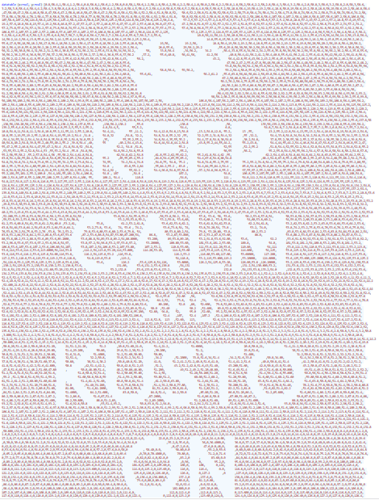
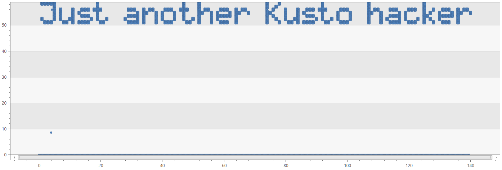

# Just Another Kusto Hacker *(JAKH)*

Back in 2017, the Azure Data Explorer (Kusto) team came up with yet another brilliant idea:
Many people simply love our query language, why don't we challenge them with writing creative, thought-provoking,
and even crazy queries, which will all be required to output the same string: `Just another Kusto hacker`
(following the well-known, and similar-in-spirit, [Just another Perl hacker]((https://en.wikipedia.org/wiki/Just_another_Perl_hacker)).

When we started this contest, we had no expectation that the queries it would yield will be so impressive and amazing.
Dozens of people within Microsoft participated in the contest (even though the prizes we offered were rather modest).
These people have proven they are true **Kusto hackers**.

Now, are *you* up for the challenge?

# And the prizes went to ...

## 1st place

The 1st place was given to a query that impressed us with its naive looks,
yet brave brute-force explosion of all possible 5-grams coming from the string `JKacehknorstu`.  

The query forms a table with 14^5 (537,824) rows using [mvexpand](TODO), over the 'L'-string characters. 
This table represents all possible combinations of the 5-grams of these characters.
Then, 5 elements that have the 'right' combinations are selected using hash values, to form the final 25 character output.

[*Click to run*](https://dataexplorer.azure.com/clusters/help/databases/Samples?query=H4sIAAAAAAAAA1VRS2vDMAy+51eYXOpAO2zZsZ3BYMeyZece2g681LRp8yJ2tzL24yd3ZTQyWEjfp/cw1l0gJXkiKXl5tZU7nLp+9OGcJj9kGPujq/5gdwmjrYJtGjqjD9lsTsrsnsKRU6ITblrctLzpPGoMaD/dZbDdLkZMTJiaYmrKqZnflV5hZh/GygZa8thBrB4rx6qxR2zdYdASeQfrD3SVxWTHvu5IQhOCsrMB30fjCF0+Nn23R0b0r68/SrqQioERWuVcGzAFKCbSOfnHDS9EIXOmCgUStGb6Hl0o0EpIrgoOQnAFAGqCG5aDZkUBgkklMRmbhvNcg9KSG8GEkFoanV7RbZKRviNLnMef29aO9bcjb857u3c47uiGBm9Kn2fr983Xxm/xbClmDj0urO72tLUn19Q+4E6y7BdMe23hDAIAAA==)
```
print L = " JKacehknorstu"
| project L = extractall('(.)', L)
| project L1 = L, L2 = L, L3 = L, L4 = L, L5 = L
| mvexpand L1 
| mvexpand L2 
| mvexpand L3 
| mvexpand L4 
| mvexpand L5
| project W = strcat(L1, L2, L3, L4, L5)
| extend H = hash(W) 
| join 
(
    datatable (H:long) 
    [
       "-4602837651782892603", 
       "819394506962427707", 
       "-6276341691233162226", 
       "-805270992304648190", 
       "-6157267418303347487"
    ]
) on H
| summarize Message = replace(@'[^\w\s]', "", tostring(makelist(W)))
```

## 2nd place

This query (from [Ben Martens](https://blogs.msdn.microsoft.com/ben/)) excited us with its ASCII-art-creation
of `Keep Calm and Kusto on`, with the desired result rendered as a scatter-chart.

Query screenshot:



See query [as CSL file](./resources/csl/jakh-2nd-place-query.csl)

Result:



## 3rd place (#1):

The "Emoji query" below shows some genuine magic.  
It looks simple and perhaps like a bluff, until a light touch of `abracadabra` turns the emojis into a real message.
Oh, you don't believe it works? Try it yourself!

[*Click to run*](https://dataexplorer.azure.com/clusters/help/databases/Samples?query=H4sIAAAAAAAAA01OS4rCQBDde4omm+7GIAgy4EKYC8wJVKSSFBLMj3QrIl5AycKFCxGZIAgK6hxhzpQjzOvBhYvXVbxfdVHGmRU0kE192DT17qep9w/MJ/AL7oh5BW5NXTnuDHwDd/igV1t4kNkhs4deOZ/jnQ/Zwwn7BUCmusvWWvDSchbhIpaSQktJoqTqaOkL0tDTBS8Lco53s5kHxuKrUxWQ4Y/ehLMwj/jFYYRklaQAjRS58V+nfdHtu1IzT1Mq4xWLLzaGpjwouUgoZPUph+0xzFLgeSOHnj8aO8HzfGHz16GUZpzExip0a/0HguPVQDwBAAA=)
```
print a='😉🐮🔬🐭🐾😚🐧🐨🌭🐡🐞🐫🔾🌊😮🐬🔭🌨🌾🌡🐚😜🌤🌞🌫'
| extend a=extractall('(.)', a)
| mvexpand a
| extend a=substring(base64_encodestring(strcat('abracadabra', a)), 19)
| summarize Message=replace(@'[+]', ' ', replace(@'[[",\]]', "", tostring(makelist(a))))
```

## 3rd place (#2)

The query below 'gambles' on the calculation of percentiles (69.8, 39.6, 35.8, ...) over a random sequence of numbers.
The percentiles are then used to select the characters that form the output message.
Yeah, it might be that if you run the query below enough times - you won't get the desired output.
But despite the risk this query takes, it never (yet) happened to us, throughout extensive testing.
Want to see it break? Reduce N to '1000' and check the output.

[*Click to run*](https://dataexplorer.azure.com/clusters/help/databases/Samples?query=H4sIAAAAAAAAA21SwY7aMBC95ytGuWCv3CiGBRatkLb37arqsUlUmWQWvDhO6phdQP34ThIILK0PkfX83puZNzHo4QWWIOPuPAaGAGXqjVrRZQkhqFVe4Ot6o9+2prRV/ds1fvf+sT8cw8egdtp6+HrhN97lyrOzgwBf7eoa3YBwHvwB3Hu0BTyj9+gakhHgVO6VMewpZEn6ARkPxWB8pXnZlate45RdI4sFjOGurWvQXqrAF5AC5JXwp6Y+CtIddc1OlcXZruWV77iv1cC8bZOUvqIy2q5Zz0ji7J/GOhZlcqbIjvJGEGy1LZZOrzcUSevHAqDTTQE/uu+rq0qQZEAraTzWIDvKUIJYBTG60QvGT4/NriyV00eE7+jyNhnKO0frtcHml3JOHVivFFAcrCp1zpLZInoQk0U0E5Npe5tHcxELGS3EeBbdi/FDNOlBOY2kWBA0uSfCXBJ0I+u4cU9sDaYtFtNrr8r4udEh4K7Pz6PdpDeO4v8t9a6X8oBDZU+a4DqBflXPumn/xVJt0dD1tG3+ifkNm0ZR5hQm1kblyJ5GSZqkYSrSLBsJGI3EZeE3Vm0BzvlfdVA+ZT0DAAA=)
```
let N = 1000000;
let alphabet = " abcdefghijklmnopqrstuvwxyz";
print Alphabet = strcat(alphabet, toupper(alphabet))
| extend Letters = extractall(@"([\w ])", Alphabet)
| extend Numbers = range(0, 2 * strlen(alphabet) - 1, 1)
| extend Zipped = zip(Letters, Numbers)
| mvexpand Zipped
| extend Letter = tostring(Zipped[0])
| extend Number = toint(Zipped[1])
| join kind=rightouter (
    range Range from 1 to N step 1
    | extend Random = rand()
    | summarize Percs = percentiles_array(Random, dynamic([69.8,39.6,35.8,37.7,0,1.9,26.4,28.3,37.7,15.1,9.4,34,0,71.7,39.6,35.8,37.7,28.3,0,15.1,1.9,5.7,20.8,9.4,34]))
    | mvexpand Percs
    | extend Number = toint(2.0 * strlen(alphabet) * Percs)
) on Number
| summarize LetterList = makelist(Letter)
| summarize Message = replace(@'[\[\"\,\]]', '', tostring(makelist(LetterList)))
```
> TODO: add more content